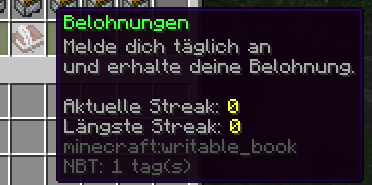

# Einleitung
Es wird ein Plugin benötigt, was den Spieler für das tägliche Wiederkommen belohnt. 
Es soll auch abstrakte Belohnungen geben. Durch ein Interface soll ermöglicht werden Nicht-Items an den Spieler zugeben, zum Beispiel:
- XP-Punkte
- Geld

Es soll die Möglichkeit existieren, dass die Belohnungen automatisch beim Anmelden eingezogen werden. ([Automatic Claiming](#automatic-claiming)). 

# Anforderungen
### Basics
- Datenbank: **MongoDB** und durch Interfaces auch SQL-Erweiterung potentiell *ermöglichen*
  Die Einstellungen für MongoDB sollen über externe Plugins gezogen werden können 
  -> Nutze Interfaces für Mongo-Connection-Einstellungen
- GUI-Framework ist Pflicht: [Obliviate-Invs](https://github.com/hamza-cskn/obliviate-invs) (persönlicher Favorit) oder Alternativen nehmen.

- (Es sollen Reward-Types von anderen Plugins eingepflegt werden können, ohne das der Source-Code des Plugins modifiziert werden muss) 
  -> Weil das nur intern genutzt wird, können wir das weglassen. 
  
### Commands
Basis Command: `/dailyrewards`
SubCommands:
- addLinearIncreasingReward \<reward_index_start> \<reward_index_end> \<lin_factor>
  -> Startet [Reward-Setup](#Reward-Setup) 
  -> Von _start_ bis _end_ wird die Belohnung **angefügt** und die Anzahl mit _lin_factor_ gestreckt.
  
- append \[index]
  -> Startet [Reward-Setup](#Reward-Setup)  
  -> Wenn _index_ angegeben ist, wird an der Stelle angefügt, sonst erste Stelle wo nichts existiert.
- remove \<index> 
  -> Löscht alles
- remove \<index> \<sub_index> 
  -> Entfernt Belohnungsliste bei _index_ das _sub_index_-Element


#### Reward-Setup
Wird getriggert durch einen Command.
Stages:
- Typ definieren. (Bsp: ItemStack, Coins, XP)
- Typ-Setup ausführen (ItemStack Setup benötigt weitere Spezifizierung, anders als XP oder Coins)
- Anzahl definieren

### Datenbank
MongoDB
```json
Spieler {
	last_claim: timestamp,
	current_start: timestamp,
	streak: int,
	laengsteStreak: int,
	StreakHistory: {
		start: timestamp,
		ende: timestamp (start * streak + timeout)
	}[]
}
```

"StreakValidation" wird beim Betreten des Servers gemacht. 

### Config
##### Mongo Anmeldedaten
Kein Kommentar. 
##### automatic-claiming
Werte: `NO/FALSE`, `PER_PLAYER`, `YES/TRUE`
PER_PLAYER: Durch eine gegebene Permission erhält der Spieler die Belohnung automatisch beim Betreten
NO: Permissions werden ignoriert, kein Spieler kriegt automatisch die Belohnung
YES: Permissions werden ignoriert, jeder Spieler kriegt die Belohnung 

##### streak-timeout
Zeitwert nachdem die Streak unterbrochen wird. (def: 32h)
### GUI Design
Paginated-GUI
Geklaut von primeblocks.net


Im Wesentlichen:
Unclaimed ->  Man sieht nur den Inhalt der Belohnungen 2 Tage im voraus. Der Rest ist nicht Ersichtbar. 
Geclaimt -> Verzaubert und angefügt an die Lore "Du hast die Belohnung eingelöst".

Inhaltsvorschau: 


⚠️ Unten soll mit einer Zeile Abstand, in grün,  "Du hast die Belohnung eingelöst" stehen


Das Buch:



Gunpowder soll durch einen Pfeil Kopf (-> | <-)  ersetzt werden. 
Beim Klicken wird die Seite gewechselt.

### Code Spezifisch
```java
public interface RewardItem {
/**
* @return Die Anzahl der Belohnungen.
*/
int getAmount();

/**
* @param player Bukkit Spieler, dem die Belohnung gegeben werden soll
* @return true wenn die Belohnung gegeben wurde. False wenn es nicht ging.
*/

boolean give(Player player);
/**
* @return Kyori adventure component was in der lore steht
*/

Component getDisplayName();
}
```


# Conventions
- Dependency Injection soll bevorzugt werden.
- Data Acessor Object Pattern (Für MongoDB & pot. SQL Support)
- MiniMessage statt legacy. 
- (Facade Pattern) weil kaum API exposed wird, ist das eig. egal.
